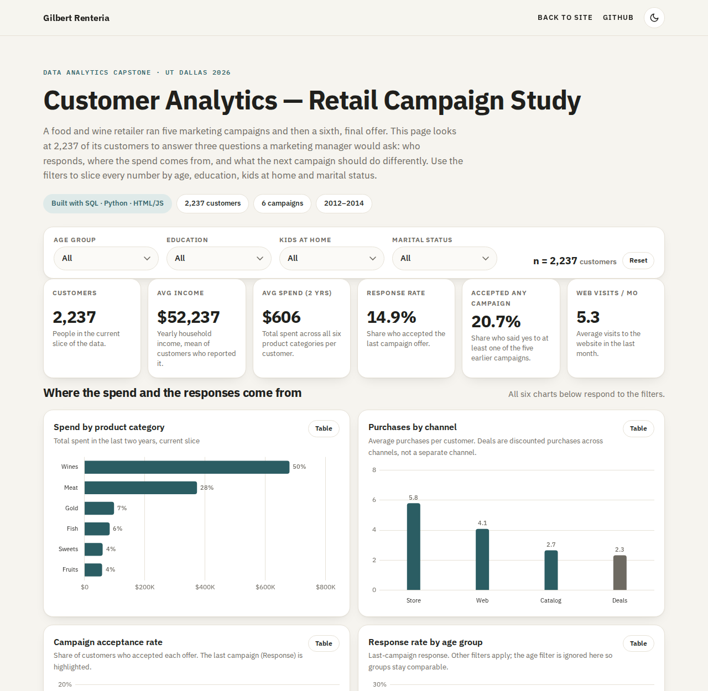
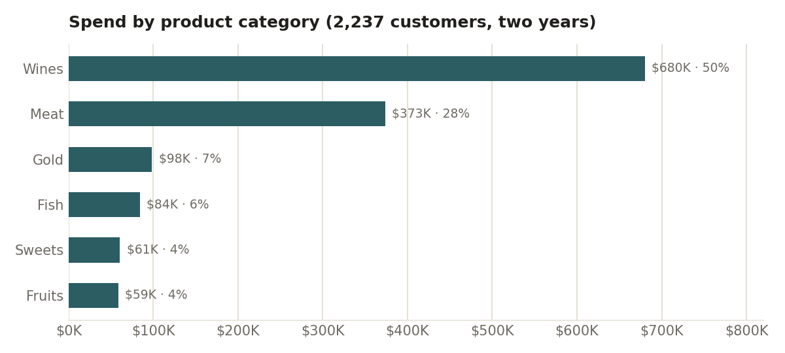
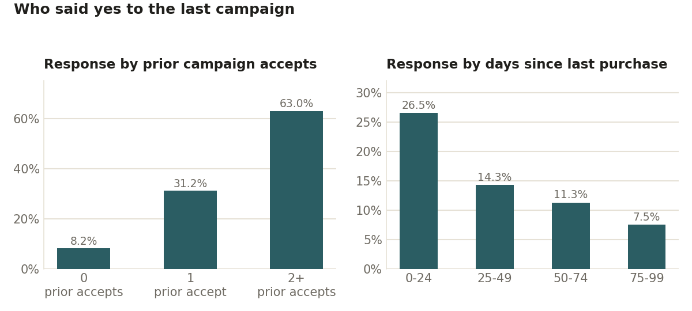
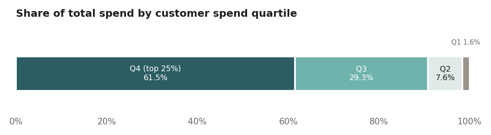

# Customer Analytics Capstone — Retail Campaign Study

A food-and-wine retailer ran six marketing campaigns; I used SQL and Python to work out who responds, where the money comes from, and what the next campaign should do differently.

Live dashboard: https://gilbertrenteria.dev/customer-analytics · UT Dallas / Fullstack Academy Data Analytics certificate, 2026 · By Gilbert Renteria

[](https://gilbertrenteria.dev/customer-analytics)

## The question

A food and wine retailer had 2,240 customers on file and had run five marketing campaigns, then a sixth, final offer. Only about 15% of customers said yes to that last offer. The retailer wanted to know which customers respond, where spend actually comes from, and what the next campaign should do to earn a better return.

## What the data showed

All numbers are from 2,237 customers (three records with birth years before 1901 were removed). "Spend" is the amount spent across six product categories over two years.

- **A quarter of customers drive 61.5% of spend.** The top 559 customers (spend of $1,047 or more) account for $833K of the $1.36M total. The bottom half of customers account for 9.3%.
- **Wine and meat are 78% of the basket.** Wines are 50.2% of spend ($680K) and meat 27.6% ($373K). Fish, gold, sweets and fruit together are the remaining 22%.
- **The last campaign converted 14.9%, about double any earlier one.** Campaigns 1–5 ran at 6.4%, 1.3%, 7.3%, 7.5% and 7.2%. 20.7% of customers accepted at least one of the five earlier offers; 27.2% accepted at least one of all six.
- **Past acceptance is the best predictor of the next yes.** Customers with two or more prior accepts responded at 63.0%, one prior accept at 31.2%, none at 8.2%.
- **Recent buyers respond 3.5x more often.** Customers who bought in the last 24 days responded at 26.5%, versus 7.5% for those 75 or more days since their last purchase.
- **Households with no kids at home spend 2–4x more.** Average spend is $1,105 with no kids at home, $473 with one and $249 with two or more; they respond at 26.5% versus 10.3%. Income is the engine underneath: the income-to-spend correlation is 0.67.
- **Age barely matters, and web browsing does not convert.** Age has a −0.02 correlation with response. Stores take 46% of purchases, web 33% and catalog 21%, yet the heaviest web visitors are the lowest spenders (correlation −0.50).







## What I'd recommend

- **Build the next campaign list from behavior, not demographics.** Prior accepters plus anyone who bought in the last 24 days is 910 customers (41% of the base). They responded at 28.7% and produced 78% of all responders; everyone else converted at 5.5%. Contact the 910 first and use the rest for a smaller, cheaper test.
- **Protect the top quartile with a retention program, not discounts.** 559 customers carry 61.5% of spend. They buy through the catalog far more than the bottom quartile (5.9 vs 0.2 purchases) and use the fewest deals (1.9 vs 2.5 for everyone else). A loyalty tier, early access and catalog-led wine and meat offers fit them; blanket discounts do not.
- **Fix web conversion for family households.** Homes with one or more kids visit the site about 6 times a month but spend the least ($473 and $249) and lean on deals (2.5 and 3.6 per customer). Put the deal-driven offers on the web where these customers already are, and track web purchases per visit as the KPI.
- **Lead with wine and meat, and split the creative by household.** Two categories are 78% of spend. Run one version for no-kids, higher-income households (premium wine, catalog) and one for family households (bundles and deals online), and report response by segment rather than one overall rate.

## How I did it

| Step | Tool | What |
|---|---|---|
| Load and clean | MySQL | Created the table, stripped `$` and `,` from Income (it was stored as text), handled 24 null incomes, added age and age-group columns, and ran the first aggregations: spend by category, response counts, customers by education and marital status. |
| Explore and analyze | Python · pandas · seaborn | Descriptive stats, age vs income, income and age distributions, spending by generation and marital status, outlier checks (box plots), a correlation matrix, and response rates by education and marital status. Ages are calculated as of 2014, the last year in the data; three birth years before 1901 were dropped. |
| Present | HTML · JavaScript · Chart.js | Built the interactive dashboard as a single self-contained page. It embeds a small pre-aggregated table, so every filter (age group, education, kids at home, marital status) recomputes in the browser with no server. |

I also built a first version of the dashboard in Tableau (income by enrollment year, education x marital status counts, income vs wine spend, spend by category); the HTML version replaces it so the page can live on my site.

## Repo map

```
.
├── README.md
├── dashboard/
│   └── index.html                  # the interactive dashboard (self-contained)
├── data/
│   ├── marketing_campaign_clean.csv  # cleaned working file (2,240 rows)
│   ├── marketing_campaign_raw.csv    # original download
│   └── data_dictionary.csv           # column descriptions
├── docs/
│   ├── dashboard.png               # screenshot of the dashboard (top)
│   ├── dashboard-full.png          # full-page screenshot
│   ├── spend_by_category.png
│   ├── who_responds.png
│   └── spend_concentration.png
├── python/
│   ├── capstone_analysis.ipynb     # the Colab notebook with outputs
│   └── capstone_analysis.py        # same analysis as a script (cd python && python capstone_analysis.py)
├── sql/
│   └── capstone_marketing_queries.sql
├── .gitignore
└── LICENSE
```

## About the data

2,240 customers of a food and wine retailer, enrolled between July 2012 and June 2014, with income, household make-up, two years of spend across six product categories, purchases by channel, monthly web visits, and yes/no flags for six campaigns. It is the public "marketing_campaign" Customer Personality Analysis teaching dataset, anonymized, and widely used in analytics courses. Income is in unlabeled monetary units; I present it as dollars for readability.

## Contact

Gilbert Renteria · gilbertrenteria@yahoo.com · [linkedin.com/in/gilbertrenteria](https://www.linkedin.com/in/gilbertrenteria) · [github.com/gilbertrenteria](https://github.com/gilbertrenteria) · [gilbertrenteria.dev](https://gilbertrenteria.dev)
